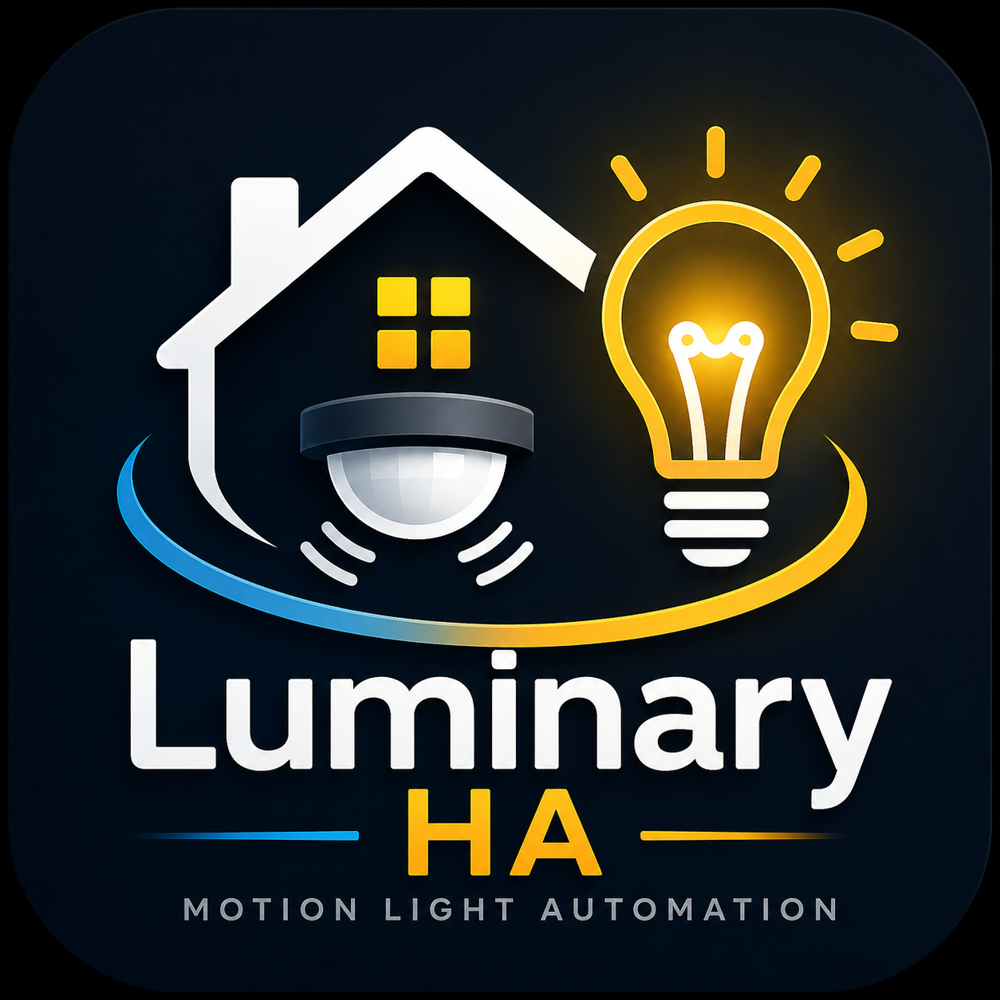

# luminary-ha



A Home Assistant custom integration for configurable motion-activated lighting in multi-sensor zones. Set it up once via the UI — no YAML required after that.

## Features

- **Multi-sensor support** — watches multiple motion sensors; all must clear before lights turn off
- **Configurable light-on time** — maximum seconds to wait for sensors to clear; acts as a safety cutoff if a sensor gets stuck
- **Stuck-sensor recovery** — when lights time out with sensors still on, polls Z-Wave JS to force a fresh state report
- **Sensor unavailable alerts** — persistent HA notification when any sensor goes offline
- **Dead-sensor detection** — persistent HA notification when a sensor stops communicating for too long, even if it never reports "unavailable" (a failing battery can hold a sensor's last state indefinitely without HA ever flagging it — see below)
- **Window brightness enforcement** — corrects the light back to the current day/night brightness on any off→on report, not just ones Luminary itself commanded (covers physical switch taps, a 3-way companion switch on the same circuit, and stale remembered dimmer levels); respects Daytime Detection, so a daytime on from outside Luminary is left alone instead of being forced bright
- **Day/night brightness profiles** — separate brightness levels for a configurable nightlight window
- **Daytime detection** — optional; suppress the automation during daylight via sun elevation or a lux sensor
- **Live configuration** — all settings are native HA entities (sliders, switches, time pickers) on the device page; no YAML edits needed
- **Three switch modes** via Z-Wave central scene (command class 91):
  - Single tap up: manual full-bright override
  - Single tap down: manual off override
  - Double tap up: disable all automation (dumb switch mode)
  - Double tap down: re-enable automation
  - Scene 3 press: panic reset — clears all overrides, turns light off

## Requirements

- Home Assistant 2024.1+
- Z-Wave JS integration (optional — required for switch scenes and stuck-sensor recovery)
- 1 or more motion sensors (binary sensors)
- A dimmable light entity
- A Z-Wave switch with **Central Scene (command class 91)** support (optional)

## Installation

### 1. Copy the integration

Copy `custom_components/luminary_ha/` into your HA config directory:

```
/config/
  custom_components/
    luminary_ha/
```

### 2. Restart Home Assistant

**Settings → System → Restart**

### 3. Add a zone

**Settings → Devices & Services → Add Integration → Luminary**

Select an area, then pick your motion sensors, light entity, and (optionally) your Z-Wave switch.

Each zone gets its own device page with all controls and settings.

## Configuration

All settings are on the device page under the **Configuration** section. Changes take effect immediately — no restart needed.

| Entity | Description |
|---|---|
| **Daytime Detection** switch | Enable/disable sun or lux suppression entirely |
| **Daytime Mode** | Sun Elevation or Lux Sensor |
| **Sun Elevation Threshold** | Activate below this sun angle (degrees). Default 3°. |
| **Lux Threshold** | Activate below this lux reading. Default 50 lx. |
| **Lux Sensor Entity** | Entity ID of your illuminance sensor |
| **Nightlight** switch | Enable/disable the dim window feature |
| **Nightlight Window Start/End** | Time range for reduced brightness |
| **Nightlight Brightness** | % brightness during nightlight window |
| **Normal Brightness** | % brightness outside nightlight window |
| **Light On Time** | Max seconds to wait for sensors to clear (see note below) |
| **Stale Sensor Alert Threshold** | Minutes of silence from a sensor before it's flagged as possibly dead. Default 60 min. |

### Controls

| Entity | Description |
|---|---|
| **Manual Override** switch | Disable auto-off; light stays on at current brightness |
| **Automation Disabled** switch | Dumb switch mode — motion ignored entirely |
| **Automation Status** sensor | Automated / Standby / Manual Override / Disabled |

## Switch Behavior Reference

| Action | When automation enabled | When dumb mode active |
|---|---|---|
| Single tap up | Full bright + manual override on | Turn light on |
| Single tap down | Light off + manual override on | Turn light off |
| Double tap up | Enable dumb mode | — (already in dumb mode) |
| Double tap down | — (already enabled) | Re-enable automation |
| Scene 3 press | Reset all overrides, lights off | Reset all overrides |

## Light On Time and Sensor Onboard Timeout

**Light On Time** (`light_on_time_sec`) is the maximum duration the automation waits for sensors to clear before forcing lights off. Lights turn off as soon as the sensor group clears — this is a ceiling, not a fixed delay.

Most Z-Wave motion sensors have a built-in **re-trigger timeout** (e.g. parameter 13 on the Zooz ZSE11). During this window the sensor stays "on" even after motion has stopped.

**Critical:** `light_on_time_sec` must be **greater than** your sensor's onboard timeout. If set lower:

1. The automation timeout fires before the sensor ever clears.
2. Lights turn off.
3. The sensor is still "on" so a new motion event cannot re-trigger the automation.
4. Lights stay off until the sensor finally clears and someone moves again.

**Rule of thumb:** sensor onboard timeout + 30–60 seconds padding. For a ZSE11 with parameter 13 = 30 s, use 60–90 s minimum.

## Dead-Sensor Detection

A motion sensor's binary on/off state isn't a reliable signal that the sensor is working — a battery-powered Z-Wave/Zigbee sensor that stops communicating entirely (dead battery, radio failure) simply holds its last reported state forever. HA has no way to distinguish that from a sensor legitimately idle between reports, so it never marks the sensor "unavailable" either.

Luminary instead watches each sensor's own **last communicated** diagnostic entity (Z-Wave JS's "Last Seen", or the Zigbee2MQTT equivalent where available) and fires a notification if a sensor goes silent longer than the **Stale Sensor Alert Threshold**. This entity is sometimes disabled by default by the owning integration — if a sensor's "Last Seen" display reads "unknown" on the Luminary device page, enable the underlying sensor once under **Settings → Devices & Services → Entities** to activate detection for it.

## Dim Window and Midnight Crossing

The dim window handles windows that span midnight (e.g., 23:00–06:00):

```
if start < end:   active when start ≤ now < end
if start > end:   active when now ≥ start OR now < end
```

## License

MIT
