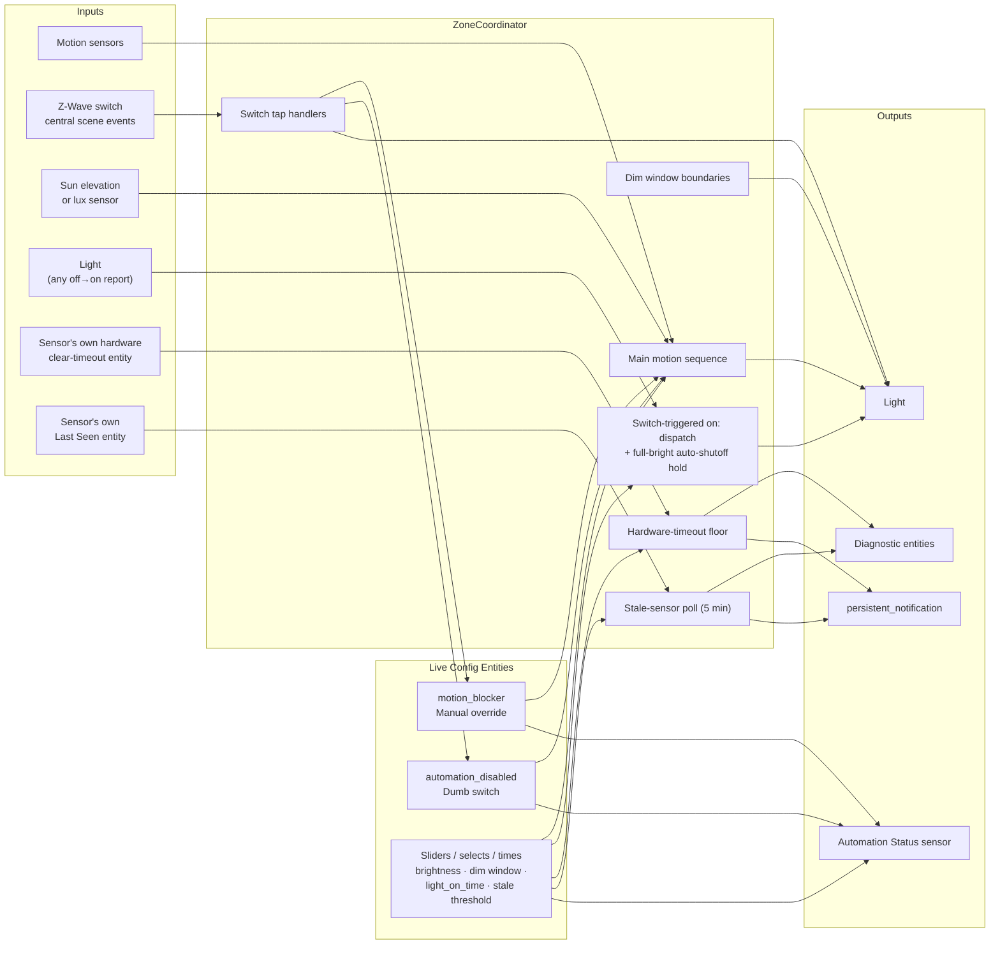
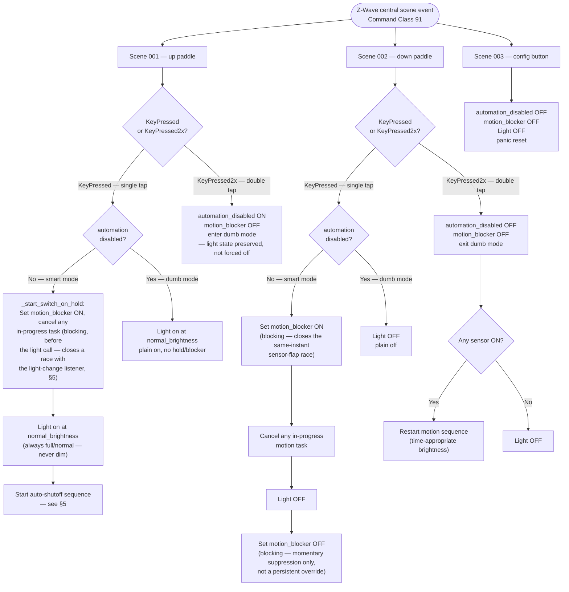
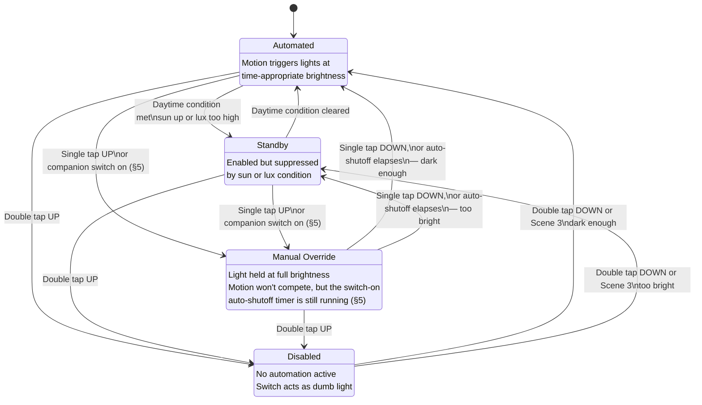
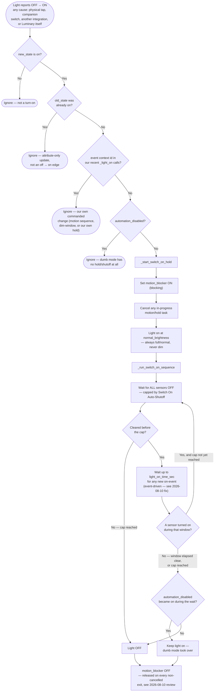
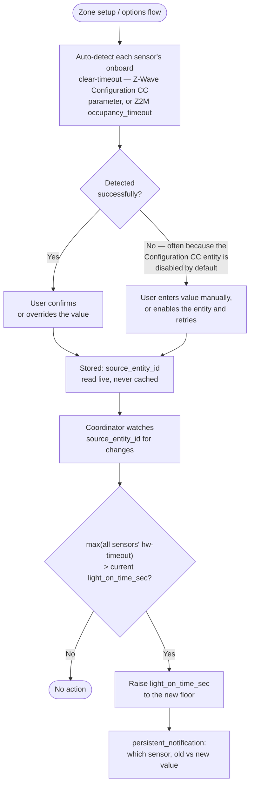

# luminary-ha — Logic Flow Diagrams

These diagrams document the automation logic in `custom_components/luminary_ha/coordinator.py`. Useful for contributors, troubleshooters, and anyone adapting the integration for a new sensor platform.

> Historical note: the project started as a YAML-only `package.yaml` (see `docs/design-notes.md`), and these diagrams described that version through 2026-06-14. The project is now a full Python custom integration — `mode: restart` automations became a cancellable `asyncio.Task`, `input_*` helpers became native HA entities, and three features (hardware-timeout auto-detection, switch-triggered full-brightness + auto-shutoff, dead-sensor detection) were added afterward that had no YAML-era equivalent. Diagrams below reflect the current Python integration.

---

## 1. System Architecture

High-level view of how components interact. `ZoneCoordinator` is the hub — one instance per configured zone.

---

## 2. Main Motion Automation

The core loop. A fresh trigger from any sensor cancels and replaces any in-progress sequence — the `asyncio.Task` equivalent of the old YAML `mode: restart`, so a new trigger resets the wait clock for free.

**Note the two separate timers:** the 30-minute wait cap is a hardcoded stuck-sensor safety net (`_stuck_timeout`), unrelated to the user-configurable `light_on_time_sec` post-clear delay. Conflating them was the original YAML design's approach; splitting them is what let `light_on_time_sec` get a hardware-derived floor without touching stuck-sensor recovery.

---

## 3. Switch Actions

Single-tap actions branch on dumb mode so the switch keeps working as a plain on/off switch even when automation is fully disabled.

**Single-tap-down history:** originally (pre-2026-08-01) this cleared `motion_blocker` unconditionally and, if any sensor was still on, restarted the motion sequence instead of turning the light off — looked like a no-op during active motion. The 2026-08-01 fix set `motion_blocker` ON before the light-off call and left it there, which closed that race but introduced a worse regression: *every* tap-down permanently latched "Manual Override," silently blocking all future motion. Found in production within a day (pantry zone). The diagram above reflects the 2026-08-02 fix — the flag is set only for the duration of the off-command (still closes the original race) and explicitly cleared right after, so it's a momentary suppression rather than a persistent override.

**Single-tap-up history:** before 2026-08-02, a single tap up turned the light on at a hardcoded 100% and set `motion_blocker` ON *indefinitely* — the light stayed at full brightness until an explicit tap-down or double-tap, with no time limit. This is what let a switch-triggered on go unnoticed for hours (see §5's incident writeup) if nobody circled back to turn it off. `_single_tap_up` now delegates to the same `_start_switch_on_hold` entry point a companion switch reaches via the light-change listener — full brightness, `motion_blocker` ON, and a timed auto-shutoff sequence, not an indefinite hold. Dumb mode (`automation_disabled`) is unaffected: it still just turns the light on with no hold, no blocker, no shutoff.

---

## 4. Status Sensor State Machine

`sensor.<zone>_automation_status` reflects which of four states the zone is in.
Priority: **Disabled > Manual Override > Automated / Standby**.

---

## 5. Switch-Triggered On: Full Brightness + Auto-Shutoff

Added 2026-07-21, substantially reworked 2026-08-02. Original incident: a physical paddle tap with no Central Scene report restored a Z-Wave dimmer's stale remembered brightness (a leftover nightlight-window level) at 4pm — completely invisible to the automation, since brightness was previously only ever *applied* through Luminary's own code paths. A `_handle_light_change` listener was added that watches the light entity directly, independent of what caused the change — but it only corrected brightness when `is_dark_enough()`, so a daytime companion-switch on was left alone entirely.

**2026-08-02 incident:** a non-Central-Scene 3-way companion switch on the hallway circuit turned the light on at a stale ~1% nightlight level at 7:51 AM — broad daylight, so the old daytime gate left it untouched, and daytime motion automation is itself inert, so *nothing* was watching to ever turn it back off. Confirmed via raw zwave-js-ui logs: the on-report had no accompanying Central Scene notification and no Supervision-session handshake, ruling out both the main paddle's own button and any Luminary-issued command — a companion switch was the only remaining explanation. The light stayed on at 1% for over an hour and a half until manually corrected.

**Fix:** the daytime gate is gone entirely. Any switch-triggered on — main paddle single-tap (`_single_tap_up`) or a companion switch (via `_handle_light_change`) — now always goes through the same `_start_switch_on_hold` entry point: full/normal brightness regardless of time of day (nightlight dim is reserved for motion-triggered activations only), plus a timed auto-shutoff so a forgotten switch-on doesn't stay on indefinitely. Self-commanded changes are recognized by HA `Context` id (set by `_light_on`) rather than by brightness happening to match, so this doesn't fight the motion sequence's own dim-brightness calls or re-trigger itself.

**Why this needs its own loop, unlike the main motion sequence (§2):** the main sequence gets torn down and restarted fresh by every new motion trigger via `_restart_motion_task` — the `asyncio.Task` equivalent of `mode: restart`. But `motion_blocker` being ON is exactly what stops `_handle_sensor_change` from calling `_restart_motion_task` in the first place (§2, first branch) — that's the whole point of the flag. So this sequence can't rely on being externally restarted by fresh motion the way §2 does; it has to watch for re-triggers itself and loop, or a person still in the hallway would get the light cut out from under them the moment the sensors happened to all read momentarily clear.

**2026-08-10 review — three defects in this path.** Found by reading rather than by an incident, so none has a confirmed production sighting; all three are fixed and covered by tests.

1. **`_handle_light_change` had no off→on edge check.** The `LC` node has always *said* "reports OFF → ON", but the code only tested `new_state`. `async_track_state_change_event` also fires for attribute-only updates, so any re-write while the light was already on — a Z-Wave dimmer's delayed confirming report, another integration touching the entity — read as a switch press and drove the zone to full brightness. HA carries the originating `Context` on entity writes for only ~5s after the service call, so a slower device report also falls outside the `C2` check; that 5s window is the only reason nightlight dimming survived this at all. The `C1B` node above is the fix.

2. **`motion_blocker` could latch permanently.** `_start_switch_on_hold` is the only thing that raises the flag and `_run_switch_on_sequence` is the only thing that lowers it, so any exit that skipped the release stranded the zone in "Manual Override" — the same failure the single-tap-down handler had on 2026-08-02. Two such exits existed: the `DIS` branch returned early (reachable by flipping `automation_disabled` from the HA UI mid-hold; double-tap-up clears the flag itself and so never exposed it), and an HA restart or integration reload mid-hold restored the flag from state with the owning task already cancelled. Now only the light-off is conditional on Disabled mode — the release is not (`REL` above) — and `motion_blocker` no longer restores across restarts, since it is transient state owned by a running sequence rather than a user preference.

3. **A zone with no switch device accepted every Z-Wave scene event in the house.** `_handle_zwave_event`'s filter read `if self.switch_device and device_id != self.switch_device: return`, which short-circuits to "accept" when `CONF_SWITCH_DEVICE` — an optional field — is unset. Any scene controller anywhere could drive such a zone's taps. No configured switch now means no tap handling at all.

**2026-08-10 incident (kitchen):** the grace-period check originally slept `light_on_time_sec` blind, then sampled sensor state *once*, at that exact instant, to decide `RETRIG`. Sensors with a short onboard hardware clear-timeout (10s — see §6, true of every sensor in every zone) report brief off-blips during continuous real occupancy, so a single instantaneous sample could land mid-blip and wrongly conclude the room was empty. Confirmed via the kitchen zone's history: cabinet lights kept getting shut off 2–11 minutes into a cooking session, well under the configured 60-minute cap, while the motion sensor was still actively cycling throughout. **Fix:** `GRACE` now watches for any new on-event over the *entire* window via a tracked state-change listener (an `asyncio.Event`, not a sleep-then-sample), giving this loop the same continuous-clear guarantee `_restart_motion_task` already gives §2. The cap and the always-full-brightness/always-eventually-off-regardless-of-daytime behavior above are unchanged.

---

## 6. Hardware-Timeout Auto-Detection & Dynamic Floor

Each motion sensor has its own onboard "how long to wait after last trigger before reporting clear" timer. `light_on_time_sec` must exceed the slowest configured sensor's timeout or lights flicker. Luminary auto-detects each sensor's value and enforces it as a live floor — never a cached snapshot, since the owning integration (Z-Wave JS / Zigbee2MQTT) is the source of truth for its own device parameters.

---

## 7. Dead-Sensor Detection (last_seen staleness)

Added 2026-07-25 after analyzing three weeks of house-wide motion-capture data: a sensor with a dying battery held its binary_sensor "on" for **4 days 3 hours**, and Z-Wave JS never once marked it "unavailable" during that window — so an on/off state or an "unavailable" watch can't detect this failure mode. The sensor's own **Last Seen** diagnostic entity, which simply stops advancing the moment the node goes silent, can.

**Why polling, not a listener:** staleness is an *absence* of updates, which a state-change listener structurally cannot observe — something has to actively check the clock. This is the one part of the coordinator that isn't purely event-driven.

**Known gap, confirmed in production:** the Last Seen entity is sometimes disabled by default by the owning integration, same as the Configuration CC entities in §6 — Luminary deliberately doesn't auto-enable it (would require reloading the underlying integration just to activate one entity), so detection silently no-ops until the user enables it once.

---

## 8. Dim Window: Midnight-Crossing Logic

The nightlight window may span midnight (e.g. start `23:00`, end `06:00`). A naive `start ≤ now < end` comparison breaks when start > end because the times wrap around. `target_brightness()` (used by the main motion sequence, the dim-window boundary handlers, and the brightness-enforcement listener in §5) handles this with a two-branch check:

**Example:**
- Start `23:00`, End `06:00`, current time `02:30`:
  - `start > end` → midnight-crossing branch
  - `02:30 >= 23:00`? No. `02:30 < 06:00`? **Yes** → dim window is active ✓
- Same config, current time `14:00`:
  - `14:00 >= 23:00`? No. `14:00 < 06:00`? No → not in dim window ✓
