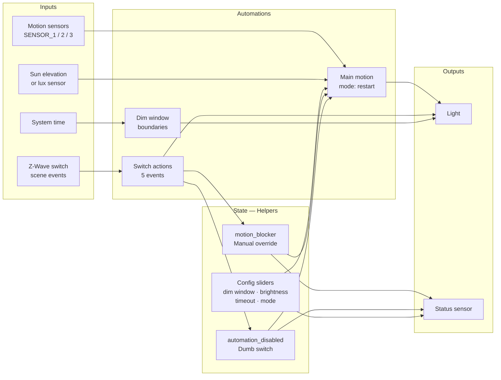
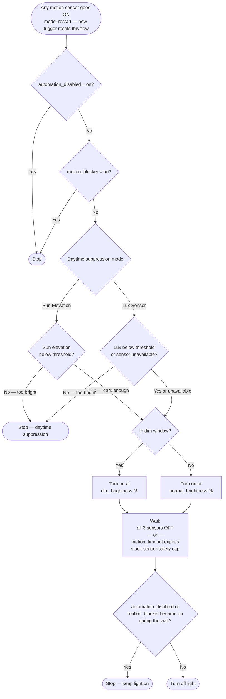
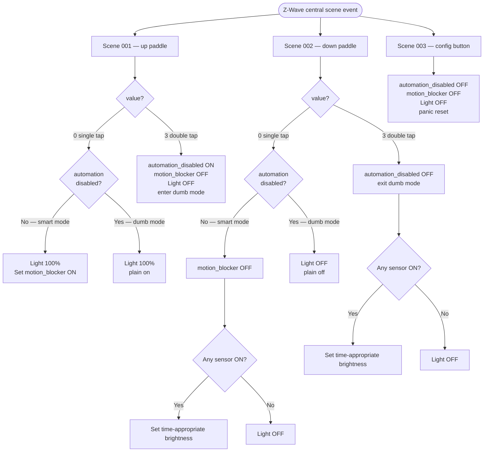
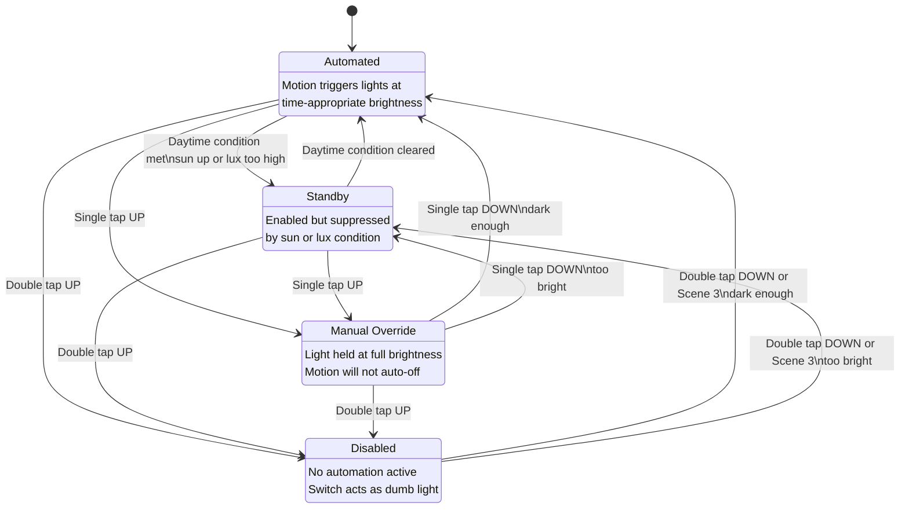

# luminary-ha — Logic Flow Diagrams

These diagrams document the automation logic in `package.yaml`. Useful for contributors, troubleshooters, and anyone adapting the package for a new room.

---

## 1. System Architecture

High-level view of how components interact.

---

## 2. Main Motion Automation

The core loop. Runs in `mode: restart` — any new motion trigger while the automation is running restarts from the top, which also resets the stuck-sensor timeout clock automatically.

---

## 3. Switch Actions

Single-tap actions branch on dumb mode so the switch keeps working as a plain on/off switch even when automation is fully disabled.

---

## 4. Status Sensor State Machine

`sensor.ZONE_automation_status` reflects which of four states the zone is in.
Priority: **Disabled > Manual Override > Automated / Standby**.

---

## 5. Dim Window: Midnight-Crossing Logic

The nightlight window may span midnight (e.g. start `23:00`, end `06:00`). A naive `start ≤ now < end` comparison breaks when start > end because the times wrap around. luminary-ha handles this with a two-branch check used in both the `set_brightness` script and the `dim_window_start/end` automations:

**Example:**
- Start `23:00`, End `06:00`, current time `02:30`:
  - `start > end` → midnight-crossing branch
  - `02:30 >= 23:00`? No. `02:30 < 06:00`? **Yes** → dim window is active ✓
- Same config, current time `14:00`:
  - `14:00 >= 23:00`? No. `14:00 < 06:00`? No → not in dim window ✓
