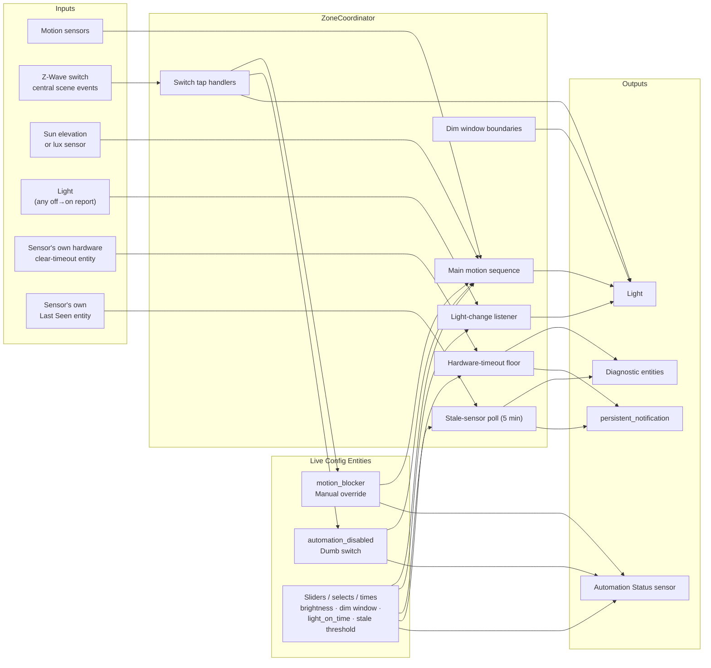
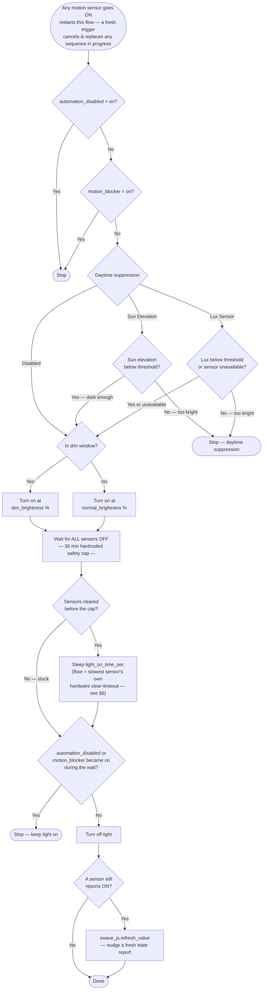
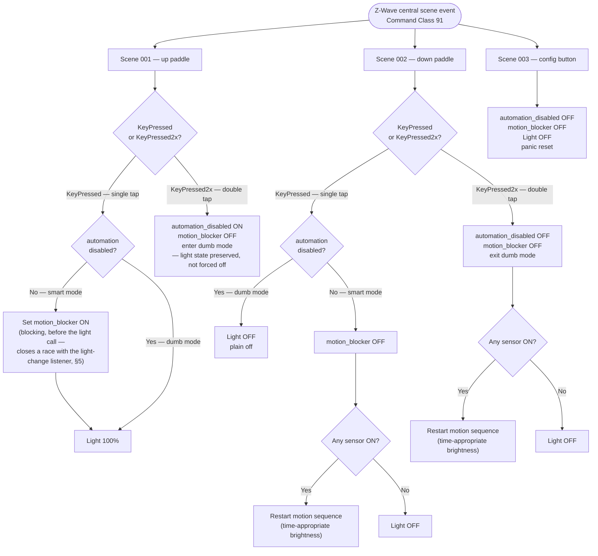
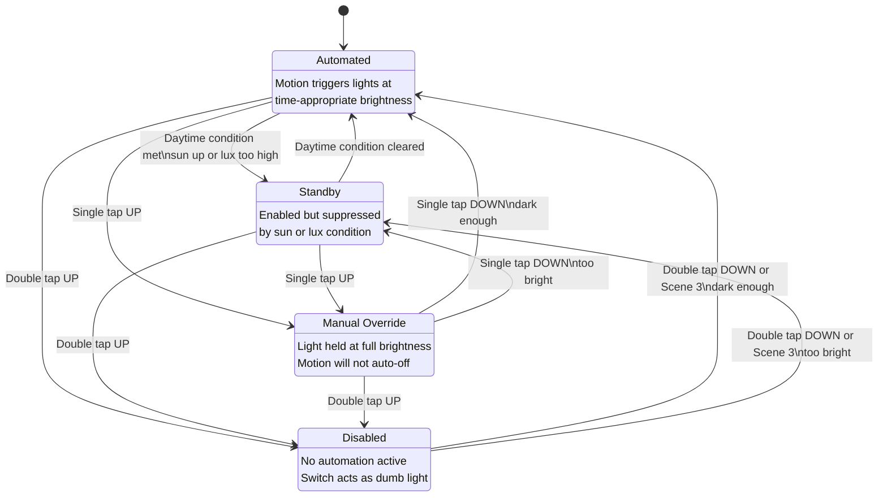
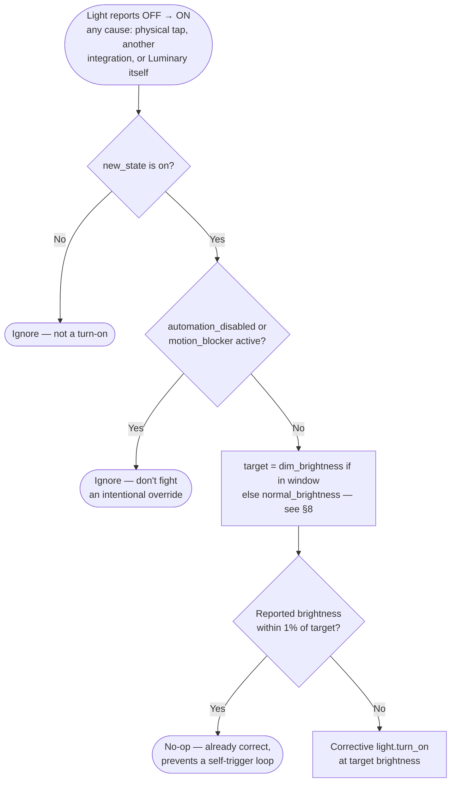
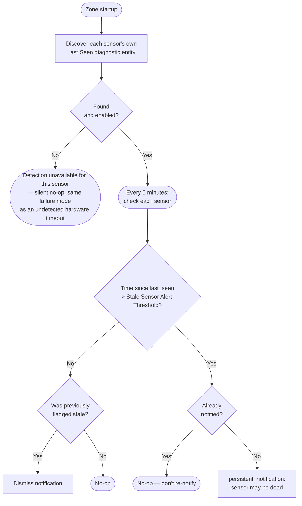
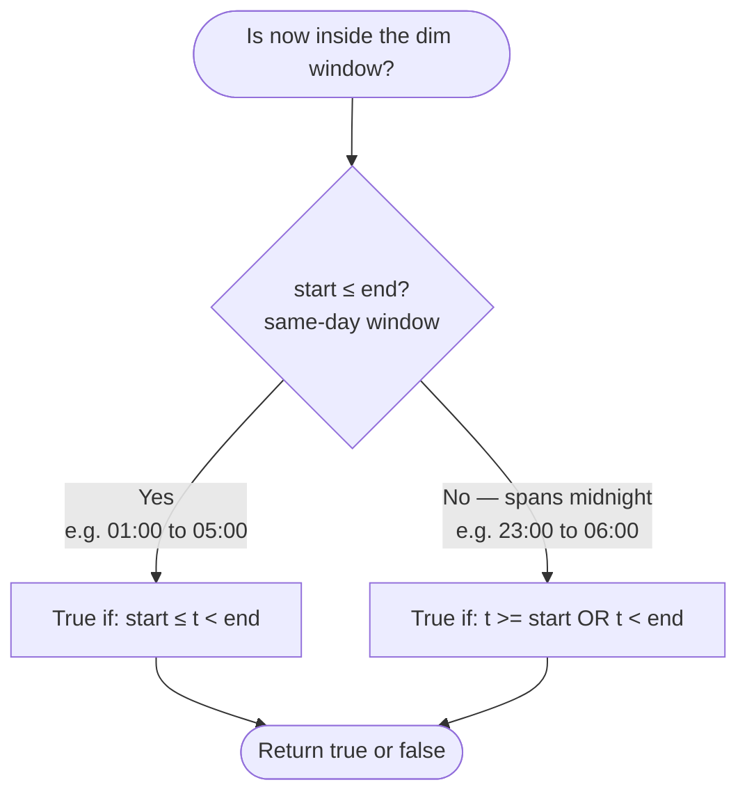

# luminary-ha — Logic Flow Diagrams

These diagrams document the automation logic in `custom_components/luminary_ha/coordinator.py`. Useful for contributors, troubleshooters, and anyone adapting the integration for a new sensor platform.

> Historical note: the project started as a YAML-only `package.yaml` (see `docs/design-notes.md`), and these diagrams described that version through 2026-06-14. The project is now a full Python custom integration — `mode: restart` automations became a cancellable `asyncio.Task`, `input_*` helpers became native HA entities, and three features (hardware-timeout auto-detection, window brightness enforcement, dead-sensor detection) were added afterward that had no YAML-era equivalent. Diagrams below reflect the current Python integration.

---

## 1. System Architecture

High-level view of how components interact. `ZoneCoordinator` is the hub — one instance per configured zone.

---

## 2. Main Motion Automation

The core loop. A fresh trigger from any sensor cancels and replaces any in-progress sequence — the `asyncio.Task` equivalent of the old YAML `mode: restart`, so a new trigger resets the wait clock for free.

**Note the two separate timers:** the 30-minute wait cap is a hardcoded stuck-sensor safety net (`_stuck_timeout`), unrelated to the user-configurable `light_on_time_sec` post-clear delay. Conflating them was the original YAML design's approach; splitting them is what let `light_on_time_sec` get a hardware-derived floor without touching stuck-sensor recovery.

---

## 3. Switch Actions

Single-tap actions branch on dumb mode so the switch keeps working as a plain on/off switch even when automation is fully disabled.

---

## 4. Status Sensor State Machine

`sensor.<zone>_automation_status` reflects which of four states the zone is in.
Priority: **Disabled > Manual Override > Automated / Standby**.

---

## 5. Window Brightness Enforcement

Added 2026-07-21 after a real incident: a physical paddle tap with no Central Scene report restored a Z-Wave dimmer's stale remembered brightness (a leftover nightlight-window level) at 4pm — completely invisible to the automation, since brightness was previously only ever *applied* through Luminary's own code paths. This listener watches the light entity directly, independent of what caused the change.

---

## 6. Hardware-Timeout Auto-Detection & Dynamic Floor

Each motion sensor has its own onboard "how long to wait after last trigger before reporting clear" timer. `light_on_time_sec` must exceed the slowest configured sensor's timeout or lights flicker. Luminary auto-detects each sensor's value and enforces it as a live floor — never a cached snapshot, since the owning integration (Z-Wave JS / Zigbee2MQTT) is the source of truth for its own device parameters.

---

## 7. Dead-Sensor Detection (last_seen staleness)

Added 2026-07-25 after analyzing three weeks of house-wide motion-capture data: a sensor with a dying battery held its binary_sensor "on" for **4 days 3 hours**, and Z-Wave JS never once marked it "unavailable" during that window — so an on/off state or an "unavailable" watch can't detect this failure mode. The sensor's own **Last Seen** diagnostic entity, which simply stops advancing the moment the node goes silent, can.

**Why polling, not a listener:** staleness is an *absence* of updates, which a state-change listener structurally cannot observe — something has to actively check the clock. This is the one part of the coordinator that isn't purely event-driven.

**Known gap, confirmed in production:** the Last Seen entity is sometimes disabled by default by the owning integration, same as the Configuration CC entities in §6 — Luminary deliberately doesn't auto-enable it (would require reloading the underlying integration just to activate one entity), so detection silently no-ops until the user enables it once.

---

## 8. Dim Window: Midnight-Crossing Logic

The nightlight window may span midnight (e.g. start `23:00`, end `06:00`). A naive `start ≤ now < end` comparison breaks when start > end because the times wrap around. `target_brightness()` (used by the main motion sequence, the dim-window boundary handlers, and the brightness-enforcement listener in §5) handles this with a two-branch check:

**Example:**
- Start `23:00`, End `06:00`, current time `02:30`:
  - `start > end` → midnight-crossing branch
  - `02:30 >= 23:00`? No. `02:30 < 06:00`? **Yes** → dim window is active ✓
- Same config, current time `14:00`:
  - `14:00 >= 23:00`? No. `14:00 < 06:00`? No → not in dim window ✓
